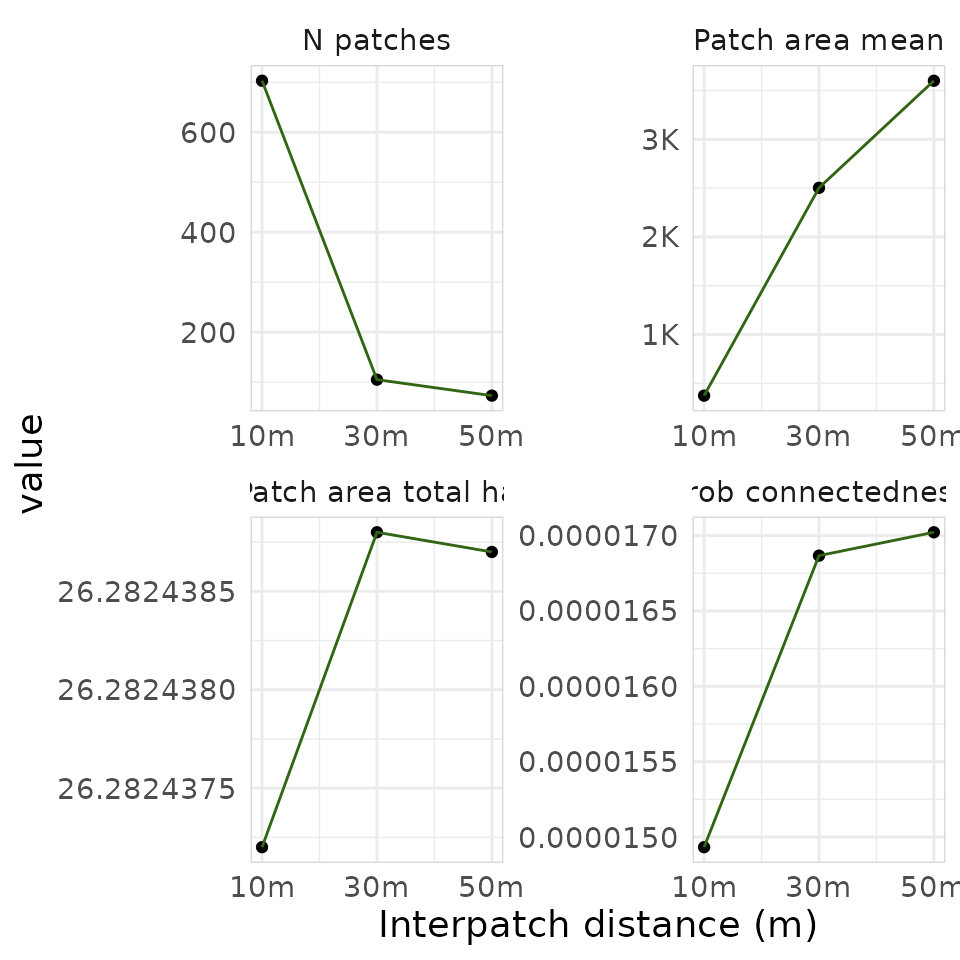

# Getting started

``` r

library(urbioconnect)
library(terra)
#> terra 1.9.50
```

## Overview

`urbioconnect` implements the habitat connectivity method described in
Kirk et al. (2023):

> Kirk, H., Soanes, K., Amati, M., Bekessy, S., Harrison, L., Parris,
> K., Ramalho, C., van de Ree, R., & Threlfall, C. (2023). Ecological
> connectivity as a planning tool for the conservation of wildlife in
> cities. *MethodsX*, 10, 101989.
> <https://doi.org/10.1016/j.mex.2022.101989>

The core idea is two habitat patches are considered connected if an
animal can travel between them without crossing a barrier (e.g., a
road). We buffer the habitat by a species-specific **interpatch
distance**, then cut those buffers wherever barriers exist. The
remaining pieces of habitat that are connected become **patches**, and
we summarise their areas to compute connectivity metrics. This workflow
is represented visually in the figure below, from the paper by Kirk et
al.:


This vignette walks through the raster workflow step by step using the
built-in Blue-tongued Lizard example data from Darebin Creek, Melbourne.
We then show how to run the same workflow in a single function call.

## The example data

The package ships with habitat and barrier rasters for a Blue-tongued
Lizard study area along Darebin Creek, between Preston and West
Heidelberg, Melbourne.

``` r

habitat <- example_habitat()
barrier <- example_barrier()

habitat
#> class       : SpatRaster
#> size        : 763, 766, 1  (nrow, ncol, nlyr)
#> resolution  : 2, 2  (x, y)
#> extent      : 326109.6, 327641.6, 5820362, 5821888  (xmin, xmax, ymin, ymax)
#> coord. ref. : GDA94 / MGA zone 55 (EPSG:28355)
#> source      : lizard_habitat_raster.tif
#> name        : Pseudo Layer
#> min value   :            1
#> max value   :            1
barrier
#> class       : SpatRaster
#> size        : 763, 766, 1  (nrow, ncol, nlyr)
#> resolution  : 2, 2  (x, y)
#> extent      : 326109.6, 327641.6, 5820362, 5821888  (xmin, xmax, ymin, ymax)
#> coord. ref. : GDA94 / MGA zone 55 (EPSG:28355)
#> source      : lizard_barrier_raster.tif
#> name        : layer
#> min value   :     0
#> max value   :     1
```

The habitat raster has value 1 where lizard habitat exists, NA
elsewhere.

``` r

plot(habitat, main = "Lizard Habitat", col = "seagreen", legend = FALSE)
```


The barrier raster has value 1 where barriers (roads exist), 0
elsewhere.

``` r

plot(barrier, main = "Lizard Barriers", col = c("white", "black"), legend = FALSE)
```


We can see these overlaid:

``` r

plot(barrier, main = "Lizard Habitat and Barrier", col = c("white", "black"), legend = FALSE)
plot(habitat, col = "seagreen", add = TRUE, legend = FALSE)
```


The dispersal distance for the blue-tongued lizard in this environment
is normally 1,000m, which suggess a interpatch_distance of 500 m – half
the connectivity threshold. This means two patches are considered
connected if the outside most edges are within 500 metres of each other.

While 500m is most accurate, the examples below use a smaller interpatch
distance to increase computational speed.

## The pipeline, step-by-step

Let’s now break down each step in the pipeline:

1.  Create barrier mask
2.  Remove habitat under barriers
3.  Buffer the habitat
4.  Fragment habitat along barriers
5.  Assign patch IDs
6.  Summarise patch areas

### Step 1: Create the barrier mask

[`create_barrier_mask()`](https://urbio-ecology.github.io/urbioconnect/reference/create_barrier_mask.md)
converts the barrier raster (1 = barrier, NA = passable) into a
multiplier mask (NA = barrier, 1 = passable). This format lets us block
movement when we multiplying layers together.

``` r

barrier_mask <- create_barrier_mask(barrier)
plot(barrier_mask, col = c("grey"), legend = FALSE)
```


### Step 2: Remove habitat under barriers

Habitat sitting directly beneath a barrier is removed before analysis.
Roads bisecting a habitat patch effectively remove the habitat for
connectivity purposes. We can see here below where the habitats have
been removed - the green spaces are habitat kep, and the orange ones are
habitat that intersected with barriers.

``` r

remaining_habitat <- drop_habitat_under_barrier(
  habitat = habitat,
  barrier_mask = barrier_mask
)
```

``` r

plot(barrier_mask, col = c("grey"), legend = FALSE)
plot(habitat, col = "#d95f02", legend = FALSE, add = TRUE)
plot(remaining_habitat, col = "#1b9e77", legend = FALSE, add = TRUE)
```


### Step 3: Buffer the habitat

[`habitat_buffer()`](https://urbio-ecology.github.io/urbioconnect/reference/habitat_buffer.md)
expands the habitat outward using a circular focal window. This is the
spatial operation of buffering, which we use to represent the interpatch
distance - here the **buffer_radius** should be *half* the species’
connectivity threshold. For example, if two patches are considered
connected when within 200 m of each other, use a 100 m buffer, as the
buffers overlap when patches are within 200 m. For the blue-tongued
lizard in urban Melbourne, the median dispersal distance is 1000 m (Kirk
et al., 2023), so we would use a buffer of 500 m. However, we use 10 for
a faster demonstration on the small example dataset, and will define
both `interpatch_distance` and `buffer_radius` at the same time.

``` r

interpatch_distance <- 10
buffer_radius <- interpatch_distance / 2

buffered_habitat <- habitat_buffer(
  habitat = remaining_habitat,
  buffer_radius = buffer_radius
)
#> Warning: Buffer radius doesn't align with the raster resolution.
#> ✖ 5 m isn't a multiple of 2 m.
#> ℹ It snaps to 4 m (interpatch distance 8 m).
#> ℹ Connectivity may shift for patches near the cut-off.
#> ℹ See `vignette(urbioconnect::interpatch-distance-and-resolution)`.

plot(barrier_mask, col = scales::alpha("grey", 1), legend = FALSE)
plot(buffered_habitat, col = "darkgreen", legend = FALSE, add = TRUE)
plot(remaining_habitat, col = "#1b9e77", legend = FALSE, add = TRUE)
```


We can now visualise the three layers together using
[`gg_barrier_habitat_interpatch_dist()`](https://urbio-ecology.github.io/urbioconnect/reference/gg_barrier_habitat_interpatch_dist.md):

``` r

gg_barrier_habitat_interpatch_dist(
  barrier = barrier,
  buffered = buffered_habitat,
  habitat = remaining_habitat,
  interpatch_distance = interpatch_distance,
  species = "Blue-tongued Lizard",
  col_barrier = "grey30",
  col_interpatch_dist = "lightgreen",
  col_habitat = "#1b9e77",
  col_paper = "white"
)
#> <SpatRaster> resampled to 500554 cells.
#> <SpatRaster> resampled to 500554 cells.
#> <SpatRaster> resampled to 500554 cells.
```


### Step 4: Fragment habitat along barriers

[`fragment_habitat()`](https://urbio-ecology.github.io/urbioconnect/reference/fragment_habitat.md)
cuts the buffered habitat wherever a barrier cell exists. This is the
step that disconnects patches separated by roads.

``` r

fragmented <- fragment_habitat(
  buffered_habitat = buffered_habitat,
  barrier_mask = barrier_mask
)

fragmented
#> class       : SpatRaster
#> size        : 763, 766, 1  (nrow, ncol, nlyr)
#> resolution  : 2, 2  (x, y)
#> extent      : 326109.6, 327641.6, 5820362, 5821888  (xmin, xmax, ymin, ymax)
#> coord. ref. : GDA94 / MGA zone 55 (EPSG:28355)
#> source(s)   : memory
#> varname     : lizard_habitat_raster
#> name        : focal_max
#> min value   :         1
#> max value   :         1
```

### Step 5: Assign patch IDs

[`assign_patches_to_fragments()`](https://urbio-ecology.github.io/urbioconnect/reference/assign_patches_to_fragments.md)
labels each habitat cell with an integer identifying which connected
patch it belongs to. Habitat cells that share a fragment blob get the
same patch ID.

``` r

patch_id_raster <- assign_patches_to_fragments(
  remaining_habitat = remaining_habitat,
  fragment = fragmented
) |>
  add_patch_area()

patch_id_raster
#> class       : SpatRaster
#> size        : 763, 766, 2  (nrow, ncol, nlyr)
#> resolution  : 2, 2  (x, y)
#> extent      : 326109.6, 327641.6, 5820362, 5821888  (xmin, xmax, ymin, ymax)
#> coord. ref. : GDA94 / MGA zone 55 (EPSG:28355)
#> source(s)   : memory
#> varnames    : lizard_habitat_raster
#>               lizard_habitat_raster
#> names       : patch_id,     area
#> min values  :        1, 4.000221
#> max values  :     1355, 4.000273
```

[`add_patch_area()`](https://urbio-ecology.github.io/urbioconnect/reference/add_patch_area.md)
appends a cell-area layer to the raster, which is needed for the area
calculations in the next step.

We can plot the patches, with each connected patch shown in a distinct
colour using
[`plot_patches()`](https://urbio-ecology.github.io/urbioconnect/reference/plot_patches.md):

``` r

plot_patches(
  patch_id = patch_id_raster,
  interpatch_distance = interpatch_distance,
  species = "Blue-tongued Lizard"
)
#> <SpatRaster> resampled to 500554 cells.
```


### Step 6: Summarise patch areas

[`aggregate_connected_patches()`](https://urbio-ecology.github.io/urbioconnect/reference/aggregate_connected_patches.md)
collapses the raster down to one row per patch, summing the area of all
habitat cells within that patch.

``` r

areas_connected <- aggregate_connected_patches(patch_id_raster)
areas_connected
#> # A tibble: 703 × 3
#>    patch_id    area area_squared
#>       <dbl>   <dbl>        <dbl>
#>  1        1    60.0        3600.
#>  2        2  1648.      2716264.
#>  3        7    12.0         144.
#>  4        8  1200.      1440195.
#>  5       10 92034.   8470191653.
#>  6       11    40.0        1600.
#>  7       12   288.        82955.
#>  8       28  1156.      1336497.
#>  9       30    64.0        4096.
#> 10       31   940.       883705.
#> # ℹ 693 more rows
```

The result has three columns:

- `patch_id` - integer identifier for the connected patch
- `area` - total habitat area within the patch (square metres)
- `area_squared` - squared area, used in the connectivity metrics below

## Computing connectivity metrics

[`summarise_connectivity()`](https://urbio-ecology.github.io/urbioconnect/reference/summarise-connectivity.md)
takes the patch area data and computes a set of landscape-level
connectivity metrics:

``` r

results <- summarise_connectivity(
  connectivity = areas_connected$area,
  interpatch_distance = interpatch_distance,
  data_resolution = 10,
  species = "Blue-tongued Lizard"
)

results
#> # A tibble: 1 × 9
#>   species     interpatch_distance n_patches effective_mesh_ha prob_connectedness
#>   <chr>                     <dbl>     <int>             <dbl>              <dbl>
#> 1 Blue-tongu…                  10       703              3.92          0.0000149
#> # ℹ 4 more variables: patch_area_mean <dbl>, patch_area_total_ha <dbl>,
#> #   data_resolution <dbl>, patch_size <list>
```

The two key metrics are:

**Effective mesh size (ha)** - the average area of the patch a randomly
chosen animal finds itself in. Larger values mean better connectivity:

``` math
m_{\text{eff}} = \frac{\sum A_i^2}{\sum A_i} \times 0.0001
```

**Probability of connectedness** - the probability that two randomly
chosen points within habitat are in the same connected patch. Ranges
from 0 (fully fragmented) to 1 (all habitat connected):

``` math
P_c = \frac{m_{\text{eff}}}{\text{total habitat area}}
```

Where $`A_i`$ is the area of a given patch.

## Run the pipeline as a single step

We developed each step of the pipeline as a set of functions that can be
run individually. If you would like to run it all in one step, you can
run
[`habitat_connectivity()`](https://urbio-ecology.github.io/urbioconnect/reference/habitat_connectivity.md).
Note the messages noting the step, and time taken. You can control this
by setting `verbose` to FALSE if you do not want the loading/running
messages.

``` r

areas <- habitat_connectivity(
  habitat = habitat,
  barrier = barrier,
  species = "Blue-tongued Lizard",
  interpatch_distance = interpatch_distance,
  verbose = TRUE
)
#> ℹ Creating barrier mask
#> ✔ Creating barrier mask [33ms]
#> 
#> ℹ Removing habitat underneath barrier
#> ✔ Removing habitat underneath barrier [24ms]
#> 
#> ℹ Adding 5m buffer (interpatch distance 10m)
#> Warning: Buffer radius doesn't align with the raster resolution.
#> ✖ 5 m isn't a multiple of 2 m.
#> ℹ It snaps to 4 m (interpatch distance 8 m).
#> ℹ Connectivity may shift for patches near the cut-off.
#> ℹ See `vignette(urbioconnect::interpatch-distance-and-resolution)`.
#> ✔ Adding 5m buffer (interpatch distance 10m) [287ms]
#> 
#> ℹ Fragmenting habitat layer along barrier intersection
#> ✔ Fragmenting habitat layer along barrier intersection [37ms]
#> 
#> ℹ Assigning patches ID to fragments
#> ✔ Assigning patches ID to fragments [2.1s]
#> 
#> ℹ Summarising area in each patch
#> ✔ Summarising area in each patch [42ms]
#> 

areas
#> # A tibble: 1 × 9
#>   species     interpatch_distance n_patches effective_mesh_ha prob_connectedness
#>   <chr>                     <dbl>     <int>             <dbl>              <dbl>
#> 1 Blue-tongu…                  10       703              3.92          0.0000149
#> # ℹ 4 more variables: patch_area_mean <dbl>, patch_area_total_ha <dbl>,
#> #   data_resolution <chr>, patch_size <list>
```

`areas` is a `connectivity` object: a one-row landscape summary
containing the same kind of metrics we computed by hand above
(`n_patches`, `effective_mesh_ha`, `prob_connectedness`, and so on). The
per-patch areas that summary is built from travel with it in a
list-column, and can be pulled out with
[`patch_sizes()`](https://urbio-ecology.github.io/urbioconnect/reference/patch_sizes.md):

``` r

patch_sizes(areas)[[1]]
#> # patch_size_tbl:      data.frame
#> # Species:             Blue-tongued Lizard
#> # Patches:             703
#> # Resolution:          2x2
#> # Interpatch Distance: 10 m
#>   patch_id    area
#>      <dbl>   <dbl>
#> 1        1    60.0
#> 2        2  1648. 
#> 3        7    12.0
#> 4        8  1200. 
#> 5       10 92034. 
#> # ℹ 698 more rows
```

The package also includes a pre-computed per-patch table (at 50 m
interpatch distance) as `lizard_areas_connected`, equivalent to
`patch_sizes(habitat_connectivity(...))[[1]]`:

``` r

lizard_areas_connected
#> # patch_size_tbl:      data.frame
#> # Species:             Blue-tongued Lizard
#> # Patches:             73
#> # Resolution:          2x2
#> # Interpatch Distance: 50 m
#>   patch_id   area
#>      <dbl>  <dbl>
#> 1        1   172.
#> 2        2  1592.
#> 3        7 98006.
#> 4        9  2416.
#> 5       10  1304.
#> # ℹ 68 more rows
```

If you need the intermediate rasters for mapping or reporting, use
[`habitat_connectivity_full()`](https://urbio-ecology.github.io/urbioconnect/reference/habitat_connectivity_full.md)
instead. It returns a named list containing the buffered habitat, patch
ID raster, barrier mask, remaining habitat, and the `areas_connected`
data frame:

``` r

result <- habitat_connectivity_full(
  habitat = habitat,
  barrier = barrier,
  interpatch_distance = interpatch_distance,
  verbose = FALSE
)

names(result)
#> [1] "buffered_habitat"  "patch_id_raster"   "areas_connected"  
#> [4] "barrier_mask"      "remaining_habitat"
```

## Comparing multiple interpatch distances

A common workflow is to run the analysis at several interpatch distances
and compare the results. Use
[`purrr::map()`](https://purrr.tidyverse.org/reference/map.html) to
iterate, then
[`purrr::list_rbind()`](https://purrr.tidyverse.org/reference/list_c.html)
to combine:

``` r

interpatch_distances <- c(10, 30, 50)
buffered_radiuses <- interpatch_distances / 2

all_results <- purrr::map(
  interpatch_distances,
  function(d) {
    habitat_connectivity(
      habitat = habitat,
      barrier = barrier,
      species = "Blue-tongued Lizard",
      interpatch_distance = d,
      verbose = FALSE
    )
  }
) |>
  purrr::list_rbind()

all_results
#> # A tibble: 3 × 9
#>   species     interpatch_distance n_patches effective_mesh_ha prob_connectedness
#>   <chr>                     <dbl>     <int>             <dbl>              <dbl>
#> 1 Blue-tongu…                  10       703              3.92          0.0000149
#> 2 Blue-tongu…                  30       105              4.43          0.0000169
#> 3 Blue-tongu…                  50        73              4.47          0.0000170
#> # ℹ 4 more variables: patch_area_mean <dbl>, patch_area_total_ha <dbl>,
#> #   data_resolution <chr>, patch_size <list>
```

Each call to
[`habitat_connectivity()`](https://urbio-ecology.github.io/urbioconnect/reference/habitat_connectivity.md)
already returns a one-row summary, so
[`purrr::list_rbind()`](https://purrr.tidyverse.org/reference/list_c.html)
stacks them directly – there’s no separate
[`summarise_connectivity()`](https://urbio-ecology.github.io/urbioconnect/reference/summarise-connectivity.md)
step needed here.

With multiple buffer distances you can visualise how connectivity
changes using
[`plot_connectivity()`](https://urbio-ecology.github.io/urbioconnect/reference/plot_connectivity.md):

``` r

plot_connectivity(all_results)
```



[`plot_connectivity()`](https://urbio-ecology.github.io/urbioconnect/reference/plot_connectivity.md)
produces a faceted ggplot2 figure showing each connectivity metric
(number of patches, probability of connectedness, mean patch area, total
habitat area) as a function of interpatch distance.

## Summary

The core raster workflow in `urbioconnect` is:

1.  [`create_barrier_mask()`](https://urbio-ecology.github.io/urbioconnect/reference/create_barrier_mask.md) -
    invert the barrier raster into a passability mask
2.  [`drop_habitat_under_barrier()`](https://urbio-ecology.github.io/urbioconnect/reference/drop_habitat_under_barrier.md) -
    remove habitat beneath barriers
3.  [`habitat_buffer()`](https://urbio-ecology.github.io/urbioconnect/reference/habitat_buffer.md) -
    expand habitat by the interpatch distance (half the connectivity
    threshold)
4.  [`fragment_habitat()`](https://urbio-ecology.github.io/urbioconnect/reference/fragment_habitat.md) -
    cut the buffer where barriers exist
5.  [`assign_patches_to_fragments()`](https://urbio-ecology.github.io/urbioconnect/reference/assign_patches_to_fragments.md) +
    [`add_patch_area()`](https://urbio-ecology.github.io/urbioconnect/reference/add_patch_area.md) -
    label and measure connected patches
6.  [`aggregate_connected_patches()`](https://urbio-ecology.github.io/urbioconnect/reference/aggregate_connected_patches.md) -
    summarise patch areas
7.  [`summarise_connectivity()`](https://urbio-ecology.github.io/urbioconnect/reference/summarise-connectivity.md) -
    compute effective mesh size and probability of connectedness

Or, equivalently, use
[`habitat_connectivity()`](https://urbio-ecology.github.io/urbioconnect/reference/habitat_connectivity.md)
for the one-row landscape summary (with per-patch data available via
[`patch_sizes()`](https://urbio-ecology.github.io/urbioconnect/reference/patch_sizes.md)),
or
[`habitat_connectivity_full()`](https://urbio-ecology.github.io/urbioconnect/reference/habitat_connectivity_full.md)
when you also need the intermediate rasters.
